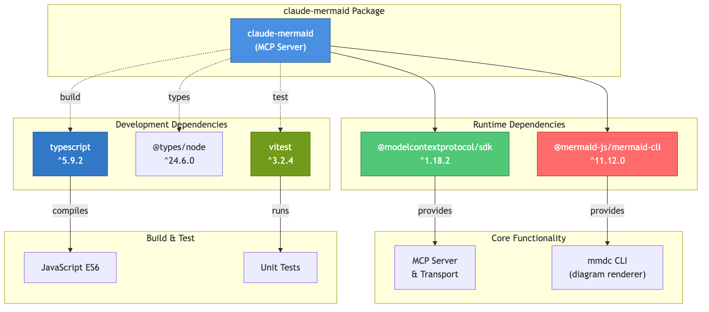
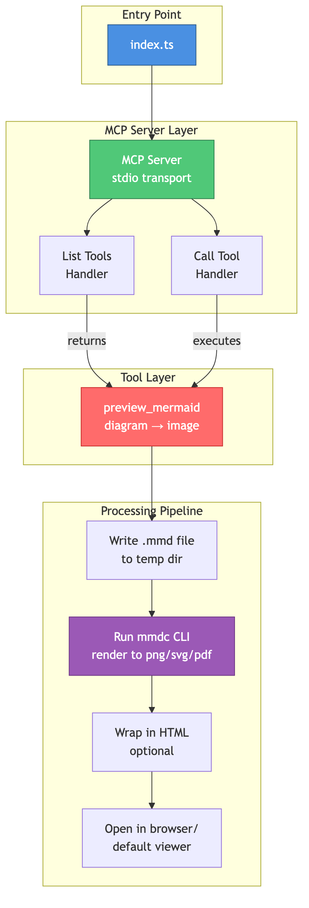
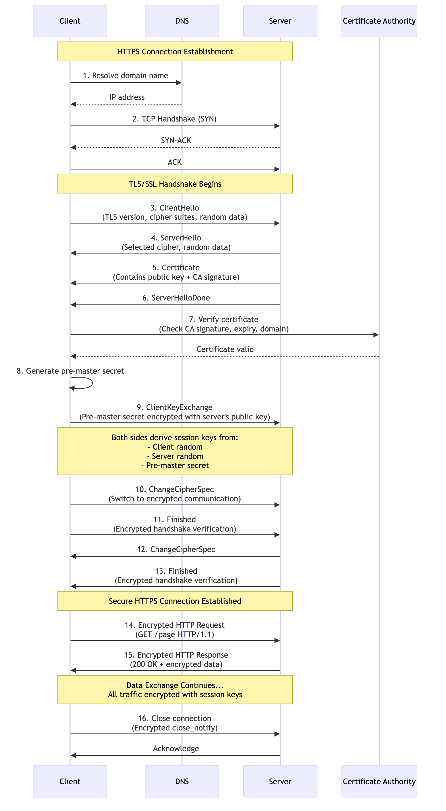

# Claude Mermaid MCP Server

MCP server for previewing Mermaid diagrams in Claude Code.


## Examples

<details>
<summary>Package Dependencies</summary>


</details>

<details>
<summary>Project Architecture</summary>


</details>

<details>
<summary>HTTPS Connection Flow</summary>


</details>

## Installation

### From Source

```bash
git clone https://github.com/yourusername/claude-mermaid.git && cd claude-mermaid
npm install
npm run build
npm install -g .
```

## Configuration

Add the MCP server to Claude Code:

```bash
claude mcp add mermaid claude-mermaid
```

Or manually add to your MCP config file:

```json
{
  "mcpServers": {
    "mermaid": {
      "command": "claude-mermaid"
    }
  }
}
```

## Usage

Once configured, you can ask Claude Code to create and preview Mermaid diagrams:

```
"Create a Mermaid diagram showing the user authentication flow"
```

Claude will automatically use the `preview_mermaid` tool to render the diagram and open it in your default browser/viewer.

### Tool Parameters

- `diagram` (required): The Mermaid diagram code
- `format` (optional): Output format - `png`, `svg`, or `pdf` (default: `png`)
- `browser` (optional): Wrap diagram in HTML page for browser viewing (default: `false`)

### Output Formats

You can request different output formats:

```
"Create user auth diagram in SVG"
"Preview pizza delivery diagram as a PDF"
"Show me diagram explaining how https works in browser" (uses browser mode with HTML wrapper)
```

### Example

```
"Create a flowchart diagram of:
graph LR
    A[User Login] --> B{Valid Credentials?}
    B -->|Yes| C[Access Granted]
    B -->|No| D[Access Denied]
    C --> E[Dashboard]
    D --> F[Try Again]

    style A fill:#e1f5ff
    style C fill:#d4edda
    style D fill:#f8d7da
"
```

The diagram will be automatically rendered and opened in your browser.

## Development

```bash
# Build
npm run build

# Watch mode
npm run dev

# Start server
npm start
```

## License

MIT
